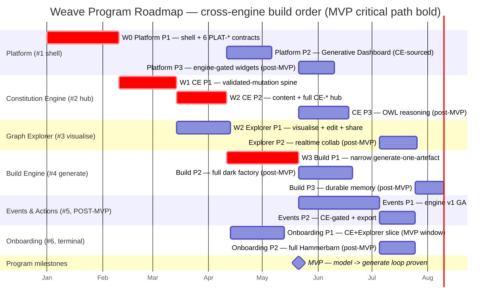

# Weave — Unified Spec

A monorepo platform for describing, visualising, and automating how a company operates — through
ontologies, knowledge graphs, and data models. Weave maps the full enterprise (people, processes,
systems, data, rules, relationships) as a navigable graph, and uses that model to generate
applications, data products, and automations — regardless of whether the underlying data lives in
Snowflake, AWS, Azure, Databricks, or on-prem.

**Positioning:** the operating system for the AI-native company — a living digital twin of the
organization (DTO). Model the business → generate code/agents/pipelines → automate. The moat is
closing that loop on open W3C standards, at mid-market reach, with whole-business NL+forms
authoring — not the triple store, which is commoditising fast (Ardoq's 2026 GraphLake acquisition
brought RDF/OWL/SHACL to an EA incumbent). This is a time-limited window: differentiate on
generation/automation closure before the substrate advantage erodes.

> **How this document is organised.** §1 is the program plan (cross-engine sequence, MVP, gates,
> risks). §2 is the shared foundations every engine inherits (stack, architecture decisions,
> conventions). §3 indexes the six per-engine specs. Canonical inter-engine contracts live in
> [`contracts.md`](contracts.md); the local dev model lives in
> [`dev-environment.md`](dev-environment.md). Engine specs cite contracts by ID — they never
> restate them.

---

## 1. Program plan

> All numeric thresholds in this document are **default X, tunable** — they resolve through the
> `PLAT-SETTINGS-1` four-level cascade (Company → Domain → Workspace → Project, tighter-wins).
> Cross-engine dependencies cite contract IDs from [`contracts.md`](contracts.md).

**MVP success criterion:** one real client models their company → Weave auto-generates one working
artefact (app, pipeline, or agent).

### 1.1 Build order and rationale

**Locked order:** Platform shell (#1) → Constitution Engine (#2) → Graph Explorer (#3) →
Build Engine (#4) → Events & Actions (#5) → Onboarding (#6).

The order is **dependency-derived, not preference**. Trace it by contract, not by the numbering:

| # | Engine | Why it sits here |
|---|--------|------------------|
| 1 | **Platform shell** | The *application shell* (app/nav/workspace/Cognito/Bedrock routing/tenancy), **not an engine**. Owns the six cross-cutting `PLAT-*` contracts that CE and every engine emit to or read from. Its Phase 1 has **no upstream engine dependency**, so it must ship first — nothing else stands up without auth, tenancy, identity, audit, notify, billing and connectors. |
| 2 | **Constitution Engine** | The **first engine** on the shell and the **contract hub**: provides `CE-READ-1 / CE-WRITE-1 / CE-DIFF-1 / CE-VERSION-1 / CE-BRAND-1 / CE-METRICS-1 / CE-EVENT-1`, which Explorer, Build, Events, Platform-dashboard and Onboarding all consume. Depends only on Platform's `PLAT-IDENTITY-1 / PLAT-AUDIT-1 / PLAT-SETTINGS-1`. Until CE exists there is no graph to visualise, generate from, or automate against. |
| 3 | **Graph Explorer** | The *visualise* half of the thin loop. Consumes CE's read/write/diff/version spine and **provides `GE-CANVAS-1`** to Build. Needs no engine below it. |
| 4 | **Build Engine** | The *generate* half. Its narrow MVP slice consumes the CE read/write/diff/version spine **and `CE-BRAND-1`** (the compliant-by-construction conformance bar). Provides `BE-ARTEFACT-1` write-back and `BE-SELFIMPROVE-1`. After the two model engines because generation grounds on the modelled graph. |
| 5 | **Events & Actions** | Whole engine is **POST-MVP**. Automates *against* the live graph (CE), reuses Build's dark-factory dispatch (`BE-SELFIMPROVE-1`), provides `EA-AUTOMATION-1`. Depends on #1–#4 contracts. |
| 6 | **Onboarding** | The terminal consumer — owns no graph data, exposes **no inter-engine contract**. Integrates the Hammerbarn seed across CE/Explorer/Build/Events, so it is built last. (Its CE+Explorer *slice* may be pulled into the MVP window — see §1.3.) |

**Platform is the foundation; CE is the first engine; the rest cascade off the CE contract hub.**

### 1.2 Cross-engine phase plan — contract-unblocked parallelism

Parallelism is **gated by which CE phase publishes the contract a consumer needs** — not "once CE
is live" as a single event. Two distinct unblock points matter:

- **CE Phase 1** publishes the spine: `CE-READ-1`, `CE-WRITE-1`, `CE-DIFF-1`, `CE-VERSION-1`.
- **CE Phase 2** publishes the rest of the hub: `CE-BRAND-1`, `CE-METRICS-1`, `CE-EVENT-1` (beta).

| Wave | Runs | Unblocked by | Parallel with |
|------|------|--------------|---------------|
| **W0** | Platform P1 (shell + 6 `PLAT-*`) | nothing (no upstream engine dep) | — (solo foundation) |
| **W1** | CE P1 (validated-mutation spine) | Platform P1 `PLAT-IDENTITY-1 / PLAT-AUDIT-1 / PLAT-SETTINGS-1` | — (next critical-path link) |
| **W2** | **Explorer P1** ∥ **CE P2** | CE **P1** spine (Explorer); Platform P1 + CE P1 (CE P2) | Explorer needs only the CE-P1 spine, so it does not wait for CE P2 |
| **W3** | **Build P1 (narrow slice)** ∥ **Platform P2 (Generative Dashboard)** | CE **P2** `CE-BRAND-1` (Build); CE **P2** `CE-METRICS-1` (dashboard) | both unblock at CE P2 and run concurrently |
| **W-par** | **Onboarding P1 (CE+Explorer slice)** | CE P1+P2 + Explorer P1 (+ Platform shell) | MVP window, parallel, **not on the thin-loop critical path** (§1.3) |

**Key correction:** Build's MVP slice does **not** unblock at CE Phase 1. Its Definition-of-Ready
lists `CE-BRAND-1`, which ships in **CE Phase 2**. So the model→generate thin loop closes only
after CE Phase 2 — CE Phase 2 is the single gate on Build's MVP contribution. Build P1 explicitly
does **not** need `GE-CANVAS-1` (that is Build Phase 2 / FR-032), so Explorer is not a Build
blocker.

The MVP critical path is therefore:
**Platform P1 → CE P1 → CE P2 → Build P1** (with Explorer P1 ∥ CE P2, dashboard ∥ Build P1).

### 1.3 MVP milestone — the thin end-to-end loop

**Definition.** The program MVP is the **thin model→generate loop** and nothing more:

> **Platform shell** (Platform P1) + **Constitution Engine** (CE P1+P2, *model*) +
> **Graph Explorer** (Explorer P1, *visualise*) + a **narrow Build slice** (Build P1, *generate
> ONE artefact*).

This proves **model → generate** end-to-end: a real client models their company in CE, sees it in
Explorer, and Weave auto-generates one working application from that model, written back into the
graph.

**Explicitly NOT in the MVP milestone** (scope discipline — honour the locked decision over each
engine's own MVP self-tagging):

- **Events & Actions** — whole engine is post-MVP.
- **Full Onboarding** — only the CE+Explorer onboarding *slice* (Onboarding P1) may run in the MVP
  *window*, in parallel; it is **not on the thin-loop critical path and not part of MVP exit
  criteria**. Full Hammerbarn demo (Build + Events seed) is post-MVP.
- **The Generative Dashboard** (Platform P2) — MVP-tagged in Platform's own roadmap, but it is
  *not* the model→generate loop. Runs in the MVP window in parallel with Build P1; **not a
  thin-loop gate**.
- **Realtime collaboration** (Explorer P2) — post-MVP.

**Constituent gates feed the program gate.** Each engine's own Phase-1 exit criteria (Platform P1,
CE P1+P2, Explorer P1, Build P1) must be green and signed off; the program-level exit criterion
below is the **end-to-end loop assertion** layered on top of them.

#### MVP exit criteria (EARS, measurable, human-signed)

- [ ] WHEN a real client authors a company model in the Constitution Engine and a product owner
      requests one application from it THE SYSTEM SHALL ground the request via `CE-READ-1`, generate
      one working application (Next.js UI + FastAPI API), and write its new services/APIs/data-assets
      back into the graph via `CE-WRITE-1` (clone→SHACL→commit) with PROV-O attribution — closing the
      model→generate loop end-to-end.
- [ ] WHEN the modelled company is opened in the Graph Explorer THE SYSTEM SHALL render it as a
      force-directed canvas via `CE-READ-1`, coloured by CE node-kind, proving the *visualise* half
      of the loop on the same model the artefact was generated from.
- [ ] WHEN the generated application is published THE SYSTEM SHALL pass the Build quality gates
      (SAST, type-check, delta-scoped mutation ≥ 70% default tunable, package-existence/secret-scan,
      and `CE-BRAND-1` conformance ≥ 90% default tunable) before any commit.
- [ ] WHEN any tenant-A principal reads across CE, Explorer, or Build THE SYSTEM SHALL return zero
      tenant-B data — verified by each engine's mandatory cross-tenant-read isolation test.
- [ ] Coverage ≥ 80% (default, tunable) · mutation ≥ 70% (default, tunable) · 0 blocking bugs
      (default, tunable) across the four MVP components.
- [ ] **Measurable artefact:** one deployed, demonstrable application (UI + API) with a shareable
      demo URL, generated from one real client's modelled company and written back into that
      company's graph — the program's one-working-artefact proof.
- [ ] **Human sign-off recorded** (always the final exit criterion).

#### MVP entry criteria (Definition of Ready)

- [ ] Platform P1, CE P1, CE P2, Explorer P1 and Build P1 each have **PRD + Phase tech spec
      approved** and **tasks decomposed + DoR-passing** (the per-engine spec-approval gates).
- [ ] The thin shared dev AWS account ([`dev-environment.md`](dev-environment.md) §1: Cognito,
      Bedrock, Secrets Manager) is provisioned and the local-first stack stands up via
      `docker compose up`.
- [ ] All MVP-path contracts are published and pinnable (`?version=latest`): the six `PLAT-*`,
      the CE spine + `CE-BRAND-1`, and `GE-CANVAS-1`.

### 1.4 Post-MVP sequence

Once the thin loop is proven, the program expands in this order (each item is a per-engine phase
already specced; sequenced by contract availability and value):

1. **Build Engine P2** — full dark factory: AI-agent + data-pipeline generation, the embedded
   project-ontology canvas (`GE-CANVAS-1`), client-app self-healing (`BE-SELFIMPROVE-1`), artefact
   staleness, decision-log export. *Needs:* Explorer `GE-CANVAS-1` GA (shipped at MVP).
2. **Events & Actions P1 (engine v1 GA)** — the whole engine: NL automation builder, full v1
   trigger/action set, run spine, governance, audit, metering. *Needs:* `PLAT-*`, CE spine,
   `BE-SELFIMPROVE-1`. Provides `EA-AUTOMATION-1`.
3. **Platform P2 dashboard CE-sourced widgets** — if not already run in the MVP window, the
   Generative Dashboard over `CE-METRICS-1`; then **Platform P3** engine-gated widget expansion as
   each source engine reaches GA.
4. **Constitution Engine P3** — publish-time OWL reasoning (OQ-01-gated) + deferred should-haves
   (bulk-populate, scheduled self-audit, saved queries).
5. **Events & Actions P2** — CE-gated triggers/actions (`CE-EVENT-1` graph-change, `CE-WRITE-1`
   graph-update) + portable Agent-SDK artefact export.
6. **Graph Explorer P2 — realtime collaboration** — Figma-style live co-edit/presence (Yjs CRDT) +
   the `CE-EVENT-1` live-stream upgrade. *Needs:* `CE-EVENT-1` GA.
7. **Onboarding P2 (full Hammerbarn demo)** — Build project + Kitchen Designer app
   (`BE-ARTEFACT-1`) and example automations (`EA-AUTOMATION-1`) as live seed areas, plus the
   Build/Events/Dashboard tours and the BE-01/AE-01 exercises. *Needs:* Build GA + Events GA.
8. **Build Engine P3** — durable agent memory + structured elicitation toolkit.

> Items 1–3 are contract-ready immediately after MVP and may overlap. Items 4–8 are gated on a
> decision (CE OQ-01) or a downstream contract (`CE-EVENT-1`, `EA-AUTOMATION-1`, `BE-ARTEFACT-1`).

### 1.5 Program-level HITL gate summary

The available gate types and where they apply. **Only spec-approval is globally mandatory; every
other gate is project/workspace-configurable and declared per-phase in the engine roadmaps.**

| Gate | Scope | Mandatory? | Typical approver |
|------|-------|------------|------------------|
| **Spec-approval** | Before *every* phase of *every* engine | **Globally mandatory** | PO + exec/eng/EA/compliance sponsor (per engine) |
| **Phase-boundary ceremony** (security-review + mutation + doc-gen) | All security-/audit-load-bearing phases — i.e. **every MVP-path phase** | Per-phase configurable | Architect / Eng lead / Tech lead + security reviewer |
| **Pre-AWS-deploy** (full local pyramid + all gates green → HITL → dev-AWS smoke → promote) | Every phase that deploys a surface ([`dev-environment.md`](dev-environment.md) §4). No autonomous path crosses this. | Per-phase configurable | Workspace admin / release approver |
| **Publish/generate** (ontology publish / artefact release) | Where a *release event* occurs: CE's first `CE-*` publish (CE P2), Explorer's `GE-CANVAS-1` release, Build's artefact write-back + demo, Events' automation activation, Onboarding's Hammerbarn seed, Platform's self-improvement dispatch. | Per-phase configurable | PO / Ontology lead / content admin |

**Program-MVP gate sequence** (the human gates the thin loop must pass, in order):

1. Platform P1 phase-gate (isolation + revocation + audit-tamper + budget + notify + self-improve authz).
2. CE P1 phase-gate (single mutation entry point + PROV-O/audit + version lifecycle + CE-READ/WRITE).
3. CE P2 phase-gate + **publish gate** (all seven `CE-*` contracts exposed; first downstream release).
4. Explorer P1 phase-gate + `GE-CANVAS-1` publish gate (concurrent with CE P2).
5. Build P1 phase-gate + artefact publish gate (generate-one-app proven, write-back validated).
6. **Program-MVP sign-off** — the end-to-end loop exit criteria (§1.3) + human sign-off.

### 1.6 Dependency matrix (engine × contract)

`P` = provides (owner), `C` = consumes.

| Contract | Owner | Platform | CE | Explorer | Build | Events | Onboarding |
|----------|-------|:--------:|:--:|:--------:|:-----:|:------:|:----------:|
| `PLAT-AUDIT-1` | Platform | **P** | C | C | C | C | C |
| `PLAT-NOTIFY-1` | Platform | **P** | C | C | C | C | C |
| `PLAT-IDENTITY-1` | Platform | **P** | C | C | C | C | C |
| `PLAT-CONNECTOR-1` | Platform | **P** | C | – | C | C | C (P2) |
| `PLAT-SETTINGS-1` | Platform | **P** | C | C | C | C | C |
| `PLAT-BILLING-1` | Platform | **P** | C | – | C | C | – |
| `CE-READ-1` | CE | C | **P** | C | C | C | C |
| `CE-WRITE-1` | CE | C (ingest) | **P** | C | C | C (P2) | C |
| `CE-DIFF-1` | CE | C | **P** | C | C | C | – |
| `CE-VERSION-1` | CE | C | **P** | C | C | C | C |
| `CE-BRAND-1` | CE | – | **P** | – | C | – | – |
| `CE-METRICS-1` | CE | C | **P** | – | – | – | C |
| `CE-EVENT-1` | CE | C | **P** | C (P2) | – | C (P2) | C (poll-degrade) |
| `GE-CANVAS-1` | Explorer | – | – | **P** | C (P2) | – | C |
| `BE-ARTEFACT-1` | Build | – | – (write via CE-WRITE-1) | – | **P** | – | C (P2) |
| `BE-SELFIMPROVE-1` | Build* | C (internal instance, P1) | – | – | **P** | C | – |
| `EA-AUTOMATION-1` | Events | C (dashboard) | – | – | – | **P** | C (P2) |

> \* `BE-SELFIMPROVE-1` is **owned by Build** but its first instance — Weave-internal product
> self-improvement — is **delivered inside Platform P1**. Provider = Build; Platform P1 delivers
> and configures the internal instance. Not double-owned.
>
> Cells marked `(P2)` / `(poll-degrade)` are post-MVP or degraded-mode consumptions; the MVP loop
> uses only the spine + `CE-BRAND-1` + `GE-CANVAS-1` + the six `PLAT-*`.

### 1.7 Program timeline (cross-engine gantt)

Dependency-ordered using relative `after` references (per-engine roadmaps carry inconsistent
absolute placeholder dates — this is the authoritative sequence). Durations are **default,
tunable** sequencing placeholders, not committed estimates.

> **Critical path (bold/crit):** Platform P1 → CE P1 → CE P2 → Build P1 → **MVP**. Explorer P1 runs
> parallel to CE P2; the dashboard and Onboarding P1 run in the MVP window in parallel but off the
> critical path.

### 1.8 Program risks

Ordered MVP-relevant first.

| # | Risk | Impact | Mitigation |
|---|------|--------|------------|
| R1 | **CE Phase 2 is the single gate on Build's MVP slice** — Build P1 needs `CE-BRAND-1` (CE P2). A CE P2 slip slips the whole MVP. | High | Treat CE P2 as program-critical; pull `CE-BRAND-1` forward; stub it behind a contract test so Build P1 builds against the stub. |
| R2 | **Platform P1 gates everything** — no engine stands up without the six `PLAT-*`; P1 ships the security-load-bearing surfaces (auth, tenancy, audit). | High | No upstream engine dep — start first, resource fully; its phase-boundary security review is mandatory and real. |
| R3 | **`CE-EVENT-1` transport not ready** (graph-change stream). | Medium | All consumers **degrade to `CE-READ-1` since-version polling**. `CE-EVENT-1` is beta in CE P2; live-stream upgrade post-MVP. No MVP-path dependency. |
| R4 | **Cross-tenant isolation regressions** across CE/Explorer/Build (shared RDF/Aurora/S3-Vectors stores). | High | Every MVP engine carries a mandatory cross-tenant-read isolation test in Phase-1 exit; the program-MVP exit re-asserts zero-tenant-B reads. Resolved through `PLAT-SETTINGS-1`. |
| R5 | **Local↔AWS parity gaps** (Oxigraph↔Neptune, Postgres↔Aurora, Ollama↔Bedrock). | Medium | The pre-AWS-deploy gate ([`dev-environment.md`](dev-environment.md) §4) runs a dev-AWS smoke suite after the local pyramid; parity preserved by standards. |
| R6 | **Bedrock cost** in dev (heavy agentic reasoning). | Medium | Tiered model routing ([`dev-environment.md`](dev-environment.md) §3): route to Ollama where a small model suffices; Bedrock only for quality-sensitive paths. |
| R7 | **Onboarding OQ-08 — Admin-path activation** needs a platform member-management signal **not yet contracted**. | Low (post-MVP) | Contract the platform invite-detection signal before Onboarding P1's Admin milestone; flagged at-risk in the Onboarding roadmap. |
| R8 | **CE OQ-01 — OWL reasoner tractability** at target scale (≥ 500k triples). | Low (post-MVP) | CE P3 cannot start until OQ-01 resolves (reasoner chosen, budget fixed); consistency-check-vs-full-inference split is the fallback. |

---

## 2. Shared foundations

Everything in this section is inherited by **all** engines. Engine specs reference it; they do not
restate it.

### 2.1 The Laws

1. **Don't assume. Don't hide confusion. Surface trade-offs.** If a requirement or intent is
   ambiguous, do not guess — stop and ask, and state the technical trade-offs of a chosen path.
2. **Minimum code that solves the problem.** No speculative features or unrequested boilerplate.
3. **Touch only what you must.** Isolate changes; clean up only your own mess unless instructed.
4. **Define success criteria. Loop until verified.** Define "success" before executing; test and
   loop until those criteria are objectively met.

### 2.2 Architecture decisions (confirmed)

- Single React SPA, modular internally (not micro-frontends).
- Multi-tenant cloud SaaS.
- Full W3C semantic web: RDF/OWL/SHACL/SPARQL/PROV.
- Weave ships a **process-centric BPMO** (Business Process Management Ontology) — the "business
  brain" — as the universal *upper framework* (~13 kinds; Processes at the centre, linked to data,
  systems, capabilities, governance, goals and actors). Clients extend it with their own domain
  kinds/instances — a **framework, not a populated taxonomy**. ArchiMate-3 aligned; REA + UFO
  behind the curtain. The canonical kind/relationship set is `CE-READ-1` in
  [`contracts.md`](contracts.md); rationale in `.claude/memory/decision_ontology-bpmo.md`.
- NL + forms editing for business users (no code required) — both ship in v1; forms are
  SHACL-shape-driven.
- AI-native throughout every layer.
- Managed connectors (7 integrations): Snowflake, Databricks, S3, Azure Data Lake, Atlassian
  (Jira + Confluence, one OAuth family), ServiceNow, Slack. Contract: `PLAT-CONNECTOR-1`.
- Tenancy/settings: four-level cascade Company → Domain → Workspace → Project (tighter-wins).
  Contract: `PLAT-SETTINGS-1`.

**Commercial model:** fully commercial SaaS + consulting/workshop engagement arm (no open source).

### 2.3 Stack (confirmed)

Decisions are final unless overridden by explicit PRD justification.

- **Backend:** Python 3.12+, FastAPI, Pydantic v2, uv. **Frontend:** TypeScript strict, Next.js 15
  App Router, Tailwind, shadcn/ui. **API:** REST (OpenAPI 3.1) + SPARQL 1.1. **Auth:** AWS Cognito
  (default) or Auth0 (multi-IdP).
- **AI/Agents:** Anthropic (Claude) Agent SDK — Python primary, TS secondary; AWS Bedrock AgentCore
  (GA components: Runtime, Memory, Identity, Gateway). Models: `claude-opus-4-8`
  (elicitation/architecture), `claude-sonnet-4-6` (generation/implementation), `claude-haiku-4-5`
  (validation/formatting). Guardrails: AWS Bedrock Guardrails.
- **Data:** RDF store Oxigraph (dev/test) → Neptune or Jena Fuseki (prod, deferred to CE tech spec);
  Vector AWS S3 Vectors; Relational AWS Aurora PostgreSQL Serverless v2 + SQLAlchemy async; Cache
  AWS ElastiCache (Redis 7).
- **Infra:** Terraform; AWS Lambda (primary) + ECS Fargate (long-running agents); CloudFront + S3
  (SPA); AWS Secrets Manager only; GitHub Actions (OIDC to AWS); CloudWatch + OpenTelemetry (ADOT).
- **Semantic web:** OWL 2 DL (Turtle); SHACL validation; PROV-O provenance; SKOS vocabulary;
  SPARQL 1.1 + Update; ArchiMate 3 notation.

### 2.4 Conventions

- Python tooling: `uv` only (hook-enforced). Secrets: AWS Secrets Manager only — never hardcoded,
  never in `.env`. Testing: TDD-first; unit → integration → E2E; Playwright; mutation ≥ 70%.
  Commits: conventional commits; stacked PRs per phase.
- Local-first dev model, model routing, and the local→deploy boundary: see
  [`dev-environment.md`](dev-environment.md).

---

## 3. Engines (index)

Each engine's full spec (brief + PRD + epics + roadmap) is a single consolidated document under
[`engines/`](engines/). They are listed in build order.

| # | Engine | Role in the loop | Spec | Owns contracts |
|---|--------|------------------|------|----------------|
| 1 | **Weave Platform** (shell) | foundation: app/nav/auth/tenancy/audit/notify/billing/connectors | [`engines/weave-platform.md`](engines/weave-platform.md) | the six `PLAT-*` |
| 2 | **Constitution Engine** | *model* — ontology/graph hub | [`engines/constitution-engine.md`](engines/constitution-engine.md) | the seven `CE-*` |
| 3 | **Graph Explorer** | *visualise* | [`engines/graph-explorer.md`](engines/graph-explorer.md) | `GE-CANVAS-1` |
| 4 | **Build Engine** | *generate* (dark factory) | [`engines/build-engine.md`](engines/build-engine.md) | `BE-ARTEFACT-1`, `BE-SELFIMPROVE-1`, `BE-SDK-1` |
| 5 | **Events & Actions** | *automate* (post-MVP) | [`engines/events-actions-engine.md`](engines/events-actions-engine.md) | `EA-AUTOMATION-1` |
| 6 | **Onboarding** | terminal consumer / Hammerbarn seed | [`engines/onboarding.md`](engines/onboarding.md) | none |

**Reference documents:** [`contracts.md`](contracts.md) (canonical inter-engine contracts — cite by
ID) · [`dev-environment.md`](dev-environment.md) (local dev model, model routing, deploy boundary).

---

*This unified spec supersedes the former split layout (`docs/specs/<engine>/<phase>/…`) and the
three glue files (`_program-roadmap.md`, `_inter-engine-contracts.md`, `_dev-environment.md`). The
pre-merge originals are archived locally under `.history/specs-pre-merge/`.*
